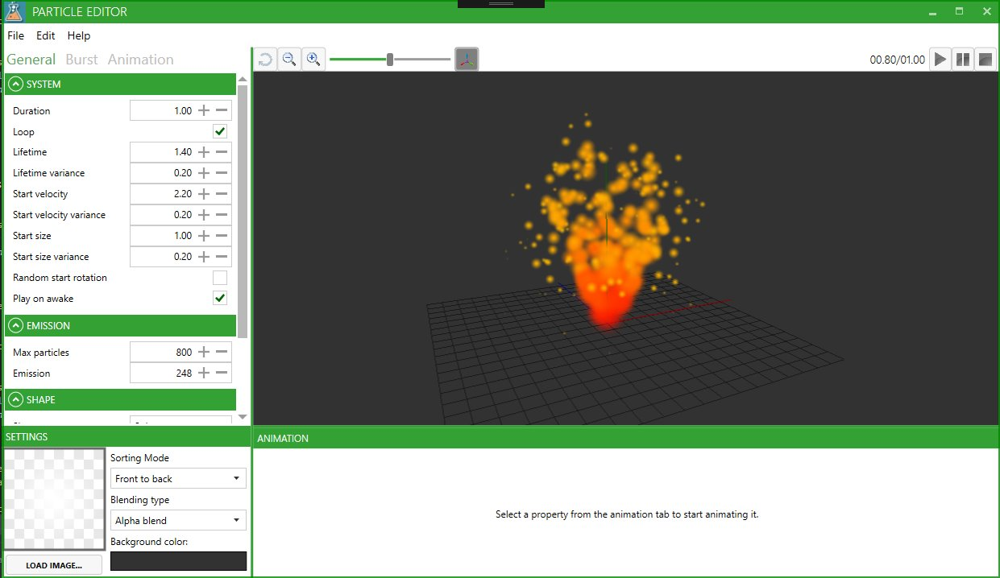

# FluxParticleEditor

This tool can be used to create and modify particle systems for FluxEngine.
The result is a json file that can be loaded up in the framework.

## External Packages
* MahApps Metro
* MvvmLight
* SharpDX
* Newtonsoft Json